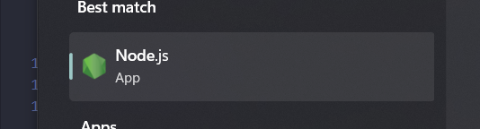

# Pertanyaan Praktikum 1

## 1. Jelaskan kegunaan masing-masing dari Git, VS Code, dan NodeJS yang telah Anda install pada sesi praktikum ini!

### a. Git
Git adalah sistem kontrol versi terdistribusi yang digunakan untuk melacak perubahan dalam kode sumber selama pengembangan. Git memungkinkan kolaborasi antara banyak developer, menyediakan kemampuan untuk membuat cabang, memeriksa perubahan, dan menggabungkan kode secara aman.

### b. Visual Studio Code (VS Code)
Visual Studio Code adalah editor kode sumber yang ringan namun kaya fitur. VS Code mendukung berbagai bahasa pemrograman, memiliki integrasi Git bawaan, dan mendukung ekstensi yang dapat meningkatkan produktivitas, seperti debugging, refactoring, dan IntelliSense.

### c. Node.js
Node.js adalah platform runtime JavaScript berbasis V8 Engine milik Google Chrome yang memungkinkan eksekusi JavaScript di server. Node.js memungkinkan pengembangan aplikasi backend menggunakan JavaScript dan mendukung arsitektur non-blocking serta event-driven.

## 2. Buktikan dengan screenshot yang menunjukkan bahwa masing-masing tools tersebut telah berhasil terinstall di perangkat Anda!

### a. Git

### b. Visual Studio Code

### c. Node.js
