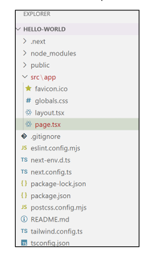

**Pertanyaan 1:**
1. **TypeScript**: TypeScript adalah bahasa pemrograman yang merupakan superset dari JavaScript, yang menambahkan tipe statis ke dalamnya. Ini memungkinkan pengembang untuk menulis kode yang lebih kuat dengan memanfaatkan tipe data untuk menangkap kesalahan lebih awal dalam proses pengembangan.
2. **ESLint**: ESLint adalah alat linter untuk JavaScript/TypeScript yang membantu mengidentifikasi dan memperbaiki masalah dalam kode, seperti kesalahan sintaks atau standar penulisan kode yang tidak konsisten. ESLint memastikan kualitas kode tetap terjaga dengan aturan-aturan yang telah ditentukan.
3. **Tailwind CSS**: Tailwind CSS adalah framework CSS berbasis utilitas yang memungkinkan pengembang membuat desain yang cepat dan efisien dengan menggunakan kelas-kelas utilitas langsung di HTML tanpa perlu menulis CSS secara manual.
4. **App Router**: App Router adalah cara baru di Next.js untuk menangani routing dalam aplikasi Next.js. Ini menggunakan konsep folder `app/` untuk mendefinisikan route dan layout aplikasi, membuat sistem routing lebih fleksibel dan modular.
5. **Import Alias**: Import alias memungkinkan pengembang menggunakan path yang lebih pendek atau disederhanakan saat mengimpor modul dalam proyek. Misalnya, daripada menggunakan import `../../../some-file`, pengembang bisa menggunakan `@/some-file` untuk mempermudah navigasi file.
6. **Turbopack**: Turbopack adalah bundler baru yang digunakan dalam proyek Next.js yang menggantikan Webpack. Ini dirancang untuk kecepatan yang lebih tinggi, khususnya untuk waktu kompilasi dan hot-reloading dalam proyek yang besar.

**Pertanyaan 2:**
- **.next**: Folder ini menyimpan file hasil build Next.js, termasuk file statis dan dynamic yang digunakan untuk rendering halaman.
- **node_modules**: Folder ini berisi semua dependensi paket yang diunduh melalui npm atau yarn yang digunakan dalam proyek.
- **public**: Folder ini berisi file-file statis seperti gambar, favicon, atau dokumen lain yang dapat diakses langsung dari root URL.
- **src**: Folder ini adalah lokasi utama untuk source code proyek, termasuk semua komponen, halaman, dan logika aplikasi.
  - **app**: Folder khusus dalam Next.js yang mengatur routing dan layout halaman aplikasi.
  - **favicon.ico**: Ikon favicon untuk situs web.
  - **globals.css**: File CSS global yang diterapkan ke seluruh aplikasi.
  - **layout.tsx**: Komponen layout utama yang digunakan untuk menyusun tampilan halaman dengan konsisten di setiap route.
  - **page.tsx**: Halaman default di dalam aplikasi yang di-render saat membuka root URL.

- **.gitignore**: File ini digunakan untuk menentukan file atau folder mana yang tidak akan di-track oleh Git.
- **package.json**: File ini berisi informasi tentang proyek dan dependensi yang dibutuhkan oleh proyek tersebut.
- **tsconfig.json**: File konfigurasi TypeScript yang digunakan untuk mengatur berbagai opsi compiler TypeScript.
- **README.md**: File ini berisi informasi tentang proyek, cara instalasi, dan penggunaan.

**Pertanyaan 3:**
Berikut adalah screenshot yang menunjukkan bahwa tahapan percobaan di atas telah berhasil saya lakukan:

